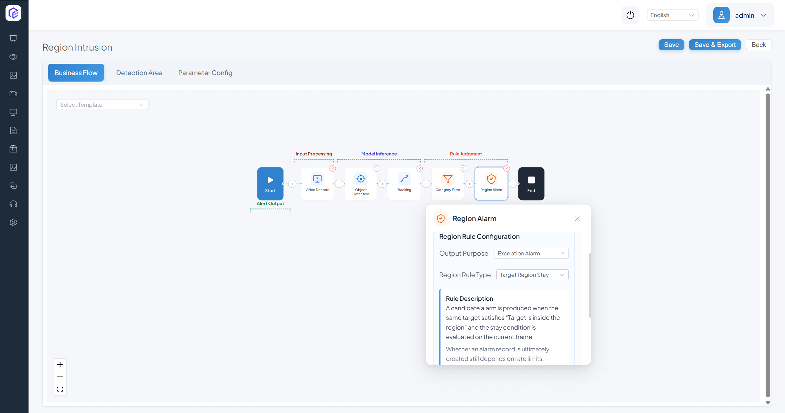

# Pipeline Orchestration: Modify and Create Pipelines

| Item | Details |
| --- | --- |
| Who this is for | Advanced users and developers who need to change business logic or combine models, rules, and event output |
| What you will accomplish | Read node data flow, safely modify an existing Pipeline, and create an accepted Region Intrusion Pipeline |
| Prerequisites | Complete scenario-task configuration and understand channels, detection areas, parameters, and Event Center |
| Estimated time | About 25–35 minutes for modification and 50–75 minutes for a new Pipeline |
| Device required | A running CosmoEdge instance and at least one playable channel; the example uses an installed pedestrian model |
| Final acceptance result | A filter change can be compared before and after, and the new Pipeline detects a person in an area and creates a queryable event |

This page has two independent paths:

- **Path A: Modify an existing Pipeline** for a local node-setting change.
- **Path B: Create a new Pipeline** for a new processing chain.

Changing a task that is assigned to a running channel affects live output. Record current settings and create a recoverable package with **Save and Export** first, and bind the change to a test channel where possible. An export is rollback material; it does not replace test isolation.

## 1. Read a Pipeline First

### 1.1 Open the No Safety Helmet Task

1. Open **Task Configuration → Scenario Task**.

   

2. Search for **No Safety Helmet**.

   

3. Click **Pipeline Orchestration**.

   

4. The page displays the node chain between Start and End.

   

The current built-in template is:

1. Video Decode
2. Object Detection
3. Tracking
4. Category Filter
5. Object Classification
6. Target Evaluation
7. Sensitivity Calculation - Timer
8. Event Report

An installed task instance in the repository can instead use **Sensitivity Calculation - Counter**. Use the nodes in the task being edited; do not mix a template name with an instance name.

### 1.2 Relate Inputs, Models, Rules, and Outputs

| Layer | Current common nodes | Input | Output |
| --- | --- | --- | --- |
| Input | Video Decode | Video file or network stream | Frames for inference |
| Model | Object Detection, Object Classification, Detection/Segmentation/Vision-Language foundation models | Image or upstream target | Boxes, classes, scores, masks, or semantic decisions |
| Rule | Tracking, Category Filter, Region Alarm, Target Evaluation, Sensitivity Calculation | Upstream targets and attributes | Associated, filtered, or evaluated targets |
| Output | Event Report | Result that satisfies the rule | Event, capture, and optional video clip |

Data moves forward: decode creates frames, detection creates targets, tracking associates identities, filters and area rules reduce candidates, and Event Report persists the final result. A downstream node can use only data provided upstream. Therefore:

- Region Alarm cannot precede target creation.
- A rule that needs a track ID cannot consume raw single-frame detections directly.
- Object Classification normally needs detected target crops upstream.
- Event Report should follow the final business decision.

### 1.3 Node-Ordering Principles

1. **Produce data before applying a rule**: inference needs frames, and area or class rules need targets.
2. **Filter early**: remove irrelevant classes and tiny targets before expensive classification or foundation-model work.
3. **Give each node one clear responsibility**: duplicate filter or decision nodes make output difficult to explain.
4. **Validate a minimal chain first**: prove decode and detection before restoring tracking, area, and event nodes.
5. **Use the current action catalog**: it does not contain a standalone Video Visualization Overlay or OSD node. Live Display renders metadata produced by the Pipeline; do not add a nonexistent component because an older guide mentioned one.

## 2. Path A: Modify an Existing Pipeline

This example adjusts the existing **Category Filter** in No Safety Helmet. The current template already contains the node, so do not add a duplicate.

### 2.1 Define the Change and Acceptance First

| Item | Content |
| --- | --- |
| Input | The same safety-helmet clip containing near and distant people |
| Before | Minimum Pedestrian Size is `60` |
| Test setting | Temporarily change it to `100` |
| Expected output | Fewer distant small targets; clear nearby people still reach classification and event rules |
| Acceptance | Fix video, ROI, and start time, compare live targets and events, then keep the change or restore `60` |

Increasing the value makes filtering stricter. It can reduce small-target noise and also miss distant people. An older screenshot changed the value to `40`, which relaxes filtering and admits more small targets; it cannot be used to claim that false positives necessarily decrease.

### 2.2 Back Up and Inspect the Node

1. Record the channels, areas, parameters, and runtime state using the task.
2. Enter the Pipeline and click **Save and Export**. Record task name, time, and current version for the file.
3. Confirm that **Category Filter** is after Tracking and before Object Classification.
4. If the task differs from the current template, understand the difference before applying a number.

### 2.3 How to Insert a Component: Only for a Test Copy That Truly Lacks the Filter

The following UI sequence restores the complete Add Component procedure. The built-in No Safety Helmet task already has the filter; perform this only in a custom test copy that does not.

1. Click the plus sign after detection/tracking and before expensive classification.

   

2. Click **Add Component**.

   

3. The panel separates algorithm actions from business processing. Find **Category Filter**; an older screenshot may show the earlier Category Selection label.

   

   

4. Confirm that it was inserted at the intended position without duplicating another filter.

   

5. Open its settings.

   

6. Select the pedestrian target label.

   

7. Enable the minimum-size filter. The current template value is `60`.

   

### 2.4 Change the Parameter and Save

For the current task, select the existing **Category Filter**, confirm its pedestrian label and size switch, and open **Parameter Settings**.

The older screenshot shows where Minimum Pedestrian Size was changed to `40`; this controlled test uses `100`, the opposite direction.

Save the Pipeline. If the page reports an unconfigured node, broken chain, or missing atomic model, do not force the save; restore required fields and upstream input first.

### 2.5 Start the Test Channel and Compare

1. Return to **Video Access** and find the test channel assigned to the task.

   

2. Start the service and confirm **In Progress**.

   

3. Open Live Display.

   

4. Select the fixed channel and video start point.

   

5. Enable the No Safety Helmet overlay and record near targets, distant targets, and events.

   

Pass when distant small targets decrease as expected while critical nearby targets are still detected, classified, and reported. If critical targets are missed, try `80` or restore `60`, rerunning the same clip after every change. Do not compare different videos.

## 3. Path B: Create a Region Intrusion Pipeline from Scratch

The current resource tree contains a repository-validated **Region Intrusion** template. This guide recreates its actual minimum business loop:

1. Video Decode
2. Object Detection
3. Tracking
4. Category Filter
5. Region Alarm
6. Event Report

The current template has **no Sensitivity Calculation node**. Region Alarm already contains Detection Time and Detection Time Unit. The optional sensitivity operation is retained later for explanation but is not added to the baseline.

### 3.1 Define Input, Configuration, Output, and Acceptance

| Item | Content |
| --- | --- |
| Input | A playable channel in which a person enters and leaves a designated area |
| Model | Installed `PedestrianDetection` atomic model |
| Rule | Track people, keep the pedestrian class, and evaluate target dwell in the primary area |
| Output | Region Intrusion event with target and captured image |
| Positive sample | A clearly visible person enters and satisfies Detection Time |
| Negative sample | A person passes only outside the area |
| Acceptance | Positive sample has target and event; negative sample has no intrusion event; task still works after restart |

### 3.2 Create the Task

1. Open **Scenario Task**.

   

2. Click **New Task**.

   

3. Enter task name “Region Intrusion Validation,” data source **Video Analysis**, and task type **Detection/Analysis**.

   

   

4. Confirm. The new task appears in the list.

   

### 3.3 Open the Empty Pipeline

1. Click **Pipeline Orchestration** for the new task.

   

2. The blank flow contains only Start and End.

   

3. Click the plus sign between them.

   

4. Select **Add Component**.

   

5. Algorithm Actions are model capabilities; Business Processing contains decode, filter, rule, and report nodes.

   

### 3.4 Add the Baseline Nodes in Order

#### Step 1: Video Decode

Select **Video Decode** from Business Processing.

It must be first.

Open the node to confirm its input responsibility; it normally needs no business parameter.

#### Step 2: Object Detection

Add **Object Detection** after Video Decode.

Confirm the order Video Decode → Object Detection.

Select atomic model `PedestrianDetection` (atomic code `1001003`) and the `pedestrian` label. The current template label threshold is about `0.63`; the installed model's UI value takes precedence.

#### Step 3: Tracking

Add **Tracking**.

Place it after Object Detection.

Select `PedestrianDetection` as the tracking input. The current Region Intrusion template exposes only Pedestrian Detection Tracking Radius `2.3`; Movement State and Shape Change in the older screenshot came from an earlier action version and should not be copied automatically.

#### Step 4: Category Filter

Add **Category Filter** after Tracking, keep `pedestrian`, enable the minimum size, and begin with template value `60`. Follow Section 2.3 for the controls. The node must precede Region Alarm so that non-pedestrian and tiny targets do not enter the rule.

#### Step 5: Region Alarm

Add **Region Alarm**.

Connect it after Category Filter.

The current Region Intrusion template uses output purpose **Exception Alarm**, region rule
**Target Region Stay**, input area **Primary Area**, and start condition **Target Inside Area**.

An older screenshot at this step used Quantity Limit for absence and gathering. That is a different region rule, not the Region Intrusion baseline.

#### Optional Concept: Why Sensitivity Is Not in the Baseline

An earlier flow added **Sensitivity Calculation - Counter** after Region Alarm:

The current template already supplies **Detection Time** and **Detection Time Unit** under Region Alarm. Do not add a second sensitivity node unless the hit-count/window contract is verified in the current runtime and fixed positive and negative samples demonstrate a benefit. Otherwise duplicated time and count rules make the trigger difficult to explain.

#### Step 6: Event Report

Add **Event Report** after the final rule.

It must precede End.

Select a tracked-target trigger event. Adding a video clip increases storage and transfer use; keep at least a captured image for local acceptance. LLM Review is an extra path and remains off so that it is not introduced together with the baseline chain.

### 3.5 Configure Current Real Parameters

Open **Parameter Settings**.

The current baseline fields are:

| Node | Current parameter | Template value | Purpose |
| --- | --- | ---: | --- |
| Object Detection | pedestrian confidence / offset | Supplied by model threshold | Accepts pedestrian candidates |
| Object Detection | pedestrian Detection Position | Bottom | Uses box bottom, center, or top for area inclusion |
| Tracking | Pedestrian Detection Tracking Radius | 2.3 | Cross-frame association scale; it must not be interpreted directly as 2.3 physical meters |
| Category Filter | Minimum Pedestrian Size | 60 | Removes people smaller than about `60 × 60` pixels |
| Region Alarm | Detection Time | 0 | Duration value for the target inside the area |
| Region Alarm | Detection Time Unit | Seconds | Combines with Detection Time; milliseconds, seconds, minutes, and hours are available |
| Event Report | Alarm Interval (seconds) | 3 | Minimum interval between target events |
| Event Report | Alarm Count | 1 | Reports for the same target type; `0` is unlimited |
| Event Report | Static Target Deduplication | Off | Suppresses repeated events from a stationary target |
| Event Report | Static Target Overlap | 0.2 | Similarity parameter for a stationary target |
| Event Report | Static Target Deduplication Time (hours) | 6 | Period during which a stationary target is not repeated |
| Event Report | Overlay Trajectory on Panorama | Off | Draws a target trajectory on the captured panorama |

::: warning Screenshot fields differ by version
The older screenshots below show target-count limits and sensitivity from a Quantity Limit plus Sensitivity experiment. Those fields do not belong to the current Region Intrusion template. Configure **Detection Time / Detection Time Unit** instead of copying absence or gathering counts.
:::

Event Report still controls interval, count, deduplication, and trajectory.

For the first test, use template values and **Detection Time = 0 seconds** to prove the chain. To suppress a transient entry, then set an explainable 1–3 seconds and rerun. Do not increase Detection Time, Sensitivity, and deduplication at the same time.

### 3.6 Assign the Pipeline to a Video Channel

1. Open **Video Access**.

   

2. Add an offline channel and upload the test media.

   

   ::: warning The upload limit shown in the screenshot is obsolete
   The image says “maximum 1 GB.” The current version uses chunked upload and admits a file according to the device's real-time safe available space. Use current required-space, available-space, and suggested-action messages.
   :::

3. Open **Scenario Task Assignment** from the channel.

   

4. The page displays available tasks and current service configuration.

   

5. Select **Region Intrusion Validation**.

   

6. Under **Detection Area**, click **Add Area**.

   

7. Enter an area name.

   

8. Adjust the polygon so that the positive sample enters and the negative sample remains outside.

   

9. Make the current time active under **Running Strategy**. Offline Video Play Count accepts `0–100`:
   `0` loops indefinitely, while `1–100` is the total number of plays.

   

10. Save and enable the service.

    

### 3.7 Accept Input, Output, and Restart

1. Open **Live Display**.

   

2. Select the test channel.

   

3. Enable the task overlay and verify the area and pedestrian target.

   

4. Play the negative sample; a person outside the area must not create an intrusion event. Play the positive sample; a person entering and satisfying Detection Time should create one.

   

5. Check event type, channel, capture, and time in Event Center.

   

6. Stop and restart the task, then replay a positive segment.

Pass when nodes persist without a broken connection, the positive sample has a pedestrian target and one explainable event, the negative sample has no intrusion event, and restart preserves processing and output.

## 4. Current Node Reference

The current video action catalog contains the following capabilities; Image Analysis has corresponding image-action variants.

| Type | Current nodes | Typical input and output |
| --- | --- | --- |
| Input | Video Decode | Video → frames |
| Basic inference | Object Detection, Object Classification, Keypoint, Feature Extraction, Text Recognition | Frame or target → boxes, classes, keypoints, features, or text |
| Tracking | Tracking | Cross-frame targets → associated IDs and state |
| Foundation models | Detection, Segmentation, and Vision-Language foundation models | Image and prompt → boxes, masks, or semantic decisions |
| Filter and evaluation | Category Filter, Target Evaluation, Region Alarm | Upstream targets → filtered or business-matched output |
| Multi-frame tolerance | Sensitivity Calculation - Timer / Counter | Continuous output → time- or count-qualified match |
| Output | Event Report | Business result → event, capture, and optional clip |

There is no standalone OSD action. Whether Live Display shows boxes, labels, trajectories, and timing depends on upstream metadata, task visualization, and the current renderer. Do not troubleshoot by adding a nonexistent node.

## 5. Reusable Pipeline Shapes

These are responsibility orders, not fixed templates to copy without validation.

### Detection and Event

Video Decode → Object Detection → optional Tracking / Category Filter → Event Report.

Use for fixed-class output, but whether business evaluation is required before reporting depends on the task.

### Detection and Region Rule

Video Decode → Object Detection → Tracking → Category Filter → Region Alarm → Event Report.

Use for Region Intrusion. Gathering, absence, and tripwire use other Region Alarm rules and parameters; changing only the task name is insufficient.

### Detect Then Classify

Video Decode → Object Detection → Tracking → Category Filter → Object Classification → Target Evaluation → optional Sensitivity → Event Report.

Use for helmet or workwear tasks. The classifier input contract must match the detected target crop.

### Prompt-Driven Task

Video Decode → Detection / Segmentation / Vision-Language foundation model → optional business rule → Event Report.

See the previous guide for prompt mode, ROI, frame rate, and remote-service boundaries.

## 6. Troubleshooting

### A Configuration Change Has No Effect

1. Reopen the Pipeline and confirm persistence.
2. Confirm that the test channel is assigned to the modified task, not an older task with the same name.
3. Check channel switch and running strategy.
4. Confirm that the changed field belongs to the actual node and label in use.
5. Compare the current configuration with the export or change record.

### A Node Does Not Run

1. Confirm output layer by layer from Video Decode.
2. Check that the atomic model is installed and matches the device backend.
3. Check node order and upstream input type.
4. Find the first failing node in logs; downstream silence is usually a result of upstream failure.
5. Reduce to Video Decode + Object Detection, then restore rule nodes one at a time.

### Detection Works but No Event Is Emitted

1. Confirm that Category Filter did not remove every target.
2. Confirm that the target enters the area and Detection Position is appropriate.
3. Restore Detection Time and event suppression to the baseline.
4. Confirm that Event Report follows the final rule and uses the correct tracked/trigger type.
5. Check Event Center filters, device time, and storage.

### Live Display Has No Boxes

Do not search for the older “Video Visualization Overlay” component. Confirm Object Detection output, task visualization support and selection, the correct overlay in Live Display, and renderer/encoder logs.

### Saving Fails or Node Connections Are Invalid

Record the page error instead of saving repeatedly. Check unconfigured model nodes, missing upstream data, duplicate rule nodes, and imported references to unavailable models. If diagnosis is not quick, restore the exported version and add one change at a time.

## 7. Pipeline Design and Delivery Checklist

- [ ] The input node can produce frames independently.
- [ ] Every model node has an atomic model available on this device.
- [ ] Every rule receives its required target, class, or track ID upstream.
- [ ] Filtering occurs before expensive downstream work.
- [ ] Event Report follows the final decision.
- [ ] No node absent from the current catalog was added from an older description.
- [ ] Every example has fixed input, configuration, expected output, and positive and negative samples.
- [ ] A recoverable export and configuration record exist before modification.
- [ ] Persistence is confirmed by reopening the page, and restart acceptance passes.

## Next Step

Read [Third-Party Model Integration](../05-model-porting/model-porting.md) to convert, upload, and connect a new model to a verifiable Pipeline.
