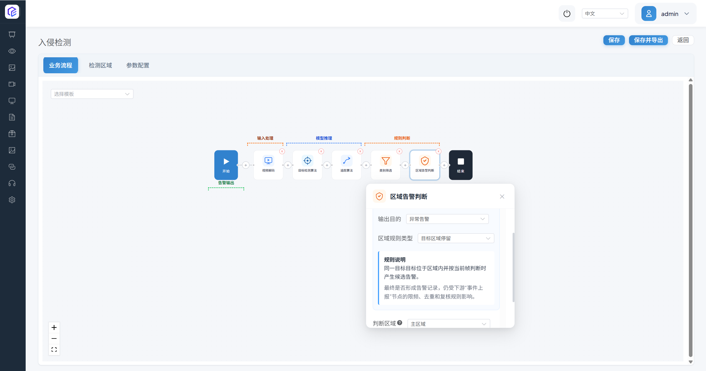

# 算法编排：修改与创建 Pipeline

| 项目 | 说明 |
| --- | --- |
| 适合谁 | 需要修改业务逻辑或组合模型、规则与事件输出的高级用户和开发者 |
| 完成后能做什么 | 看懂节点数据流，安全修改已有 Pipeline，并创建可验收的区域入侵 Pipeline |
| 使用前提 | 已完成场景任务配置；了解通道、检测区域、参数和事件中心 |
| 预计时间 | 修改路径约 25–35 分钟；新建路径约 50–75 分钟 |
| 是否需要设备 | 需要运行中的 CosmoEdge 和至少一个可播放通道；示例使用当前已安装的行人模型 |
| 最终验收结果 | 修改后的过滤规则可前后对比；新建 Pipeline 能检测区域内人员并形成可查询事件 |

本页提供两条独立路径：

- **路径 A：修改已有 Pipeline**，适合局部调整节点配置。
- **路径 B：创建新的 Pipeline**，适合定义一条新的处理链。

修改正在被通道使用的任务会影响运行结果。先记录当前配置并使用 **保存并导出** 创建可恢复版本，最好把修改绑定到测试通道。导出包是回退材料，不替代测试隔离。

## 1. 先看懂 Pipeline

### 1.1 打开未戴安全帽任务

1. 打开 **任务配置 → 场景任务**。

   

2. 搜索并找到 **未戴安全帽**。

   

3. 点击 **算法编排**。

   

4. 编排页显示从开始到结束的节点链。

   

当前内置模板顺序是：

1. 视频解码
2. 目标检测算法
3. 追踪算法
4. 类别过滤
5. 目标分类算法
6. 目标判断
7. 灵敏度计算-计时
8. 事件上报

仓库中的已安装任务实例也可能使用 **灵敏度计算-计数**。应以正在编辑的任务节点为准，不把模板和实例名称混为一谈。

### 1.2 输入、模型、规则和输出的关系

| 层 | 当前常见节点 | 输入 | 输出 |
| --- | --- | --- | --- |
| 输入 | 视频解码 | 视频文件或网络流 | 可供推理的图像帧 |
| 模型 | 目标检测算法、目标分类算法、检测/分割/语言视觉大模型 | 图像或上游目标 | 检测框、类别、分数、分割结果或语义判断 |
| 规则 | 追踪算法、类别过滤、区域告警判断、目标判断、灵敏度计算 | 上游目标及属性 | 被关联、过滤或判定后的目标 |
| 输出 | 事件上报 | 满足规则的结果 | 事件、抓拍图和可选视频片段 |

数据按节点顺序向后传递：视频解码产生帧，检测产生目标，追踪关联跨帧身份，过滤与区域规则缩小候选，事件上报保存最终结果。下游只能使用上游实际提供的数据，所以：

- 区域判断不能放在产生目标之前；
- 需要跟踪 ID 的规则不能直接消费未经追踪的单帧结果；
- 目标分类通常需要上游先检测并裁剪目标；
- 事件上报应位于最终业务判断之后。

### 1.3 节点排序原则

1. **先产生数据，再应用规则**：没有图像帧就不能推理，没有目标就不能做区域或类别规则。
2. **尽早过滤无用结果**：在昂贵分类或大模型节点之前过滤无关类别和过小目标。
3. **一个节点承担一个明确职责**：重复插入同类过滤或判断节点会让结果难以解释。
4. **先验证最小链路，再逐项增加**：视频解码与检测通过后再加追踪、区域和事件。
5. **用当前动作目录判断可用节点**：当前视频动作目录没有独立的“视频可视化叠加/OSD”节点。实时展示根据 Pipeline 输出元数据完成渲染；不要因为旧截图或旧说明而添加不存在的组件。

## 2. 路径 A：修改已有 Pipeline

本例调整 **未戴安全帽** 中已经存在的 **类别过滤** 节点。当前模板已有该节点，所以不要重复添加。

### 2.1 先定义修改与验收

| 项目 | 内容 |
| --- | --- |
| 输入 | 同一段包含近处和远处人员的安全帽视频 |
| 修改前 | 最小行人尺寸为 `60` |
| 测试配置 | 临时改为 `100` |
| 预期输出 | 远处小目标减少，近处清晰人员仍进入分类和事件规则 |
| 验收 | 固定视频、ROI 和起点，对比实时目标与事件；通过后保留，否则恢复 `60` |

数值增大使过滤更严格，可能减少小目标噪声，也会增加远处行人漏报。旧版截图中曾把值改为 `40`，这会放宽过滤、让更多小目标通过，不能据此声称误报必然下降。

### 2.2 备份并检查节点

1. 记录当前使用该任务的通道、区域、参数和运行状态。
2. 进入算法编排，点击 **保存并导出**，给导出文件记录任务名、时间和当前版本。
3. 确认 **类别过滤** 位于追踪之后、分类之前。
4. 如果任务结构与当前模板不同，先理解差异，不直接套用数值。

### 2.3 组件插入方法：只用于确实缺少过滤节点的测试副本

下面的界面序列恢复了旧版“添加组件”完整操作。当前内置未戴安全帽任务已经有过滤节点；只有自建测试副本确实缺少它时才执行。

1. 在目标检测/追踪之后、昂贵分类之前点击加号。

   

2. 点击 **添加组件**。

   

3. 面板分为算法动作与业务处理。找到当前界面显示的 **类别过滤**；较早截图可能显示“类别筛选”。

   

   

4. 确认节点插入预期位置，且没有重复过滤节点。

   

5. 打开节点配置。

   

6. 目标标签选择行人。

   

7. 开启最小尺寸过滤。该节点的当前模板值为 `60`。

   

### 2.4 修改参数并保存

当前任务无需新增节点，直接选择现有 **类别过滤**，确认行人标签和最小尺寸开关，然后打开 **参数设置**。

旧版截图展示把最小行人尺寸改为 `40` 的位置；本次可解释试验改为 `100`，方向相反。

保存 Pipeline。若页面提示节点未配置、链路断开或缺少原子模型，不要强行继续；先恢复必填项和上游输入。

### 2.5 启动测试通道并对比

1. 返回 **视频接入**，找到绑定该任务的测试通道。

   

2. 启动服务并确认状态“进行中”。

   

3. 进入实时展示。

   

4. 选择固定通道与同一视频起点。

   

5. 打开未戴安全帽算法叠加，记录近处和远处目标以及事件数量。

   

通过标准：与修改前相比，远处小目标按预期减少，近处关键目标仍能被检测、分类并产生事件。关键目标漏报时，逐步降低到 `80` 或恢复 `60`，每次使用同一片段复测。不要用不同视频前后对比。

## 3. 路径 B：从零创建区域入侵 Pipeline

当前资源目录已有经过仓库配置验证的 **区域入侵** 模板。这里按它的实际最小闭环创建：

1. 视频解码
2. 目标检测算法
3. 追踪算法
4. 类别过滤
5. 区域告警判断
6. 事件上报

当前模板**没有灵敏度计算节点**。区域告警判断自身提供检测时间与单位。后文保留灵敏度组件的操作说明，但不把它加入本例基线。

### 3.1 定义输入、配置、输出和验收

| 项目 | 内容 |
| --- | --- |
| 输入 | 能正常播放且有人进出指定区域的视频通道 |
| 模型 | 已安装的 `PedestrianDetection` 行人检测原子模型 |
| 规则 | 追踪行人、保留行人类别、判断目标是否在主区域停留 |
| 输出 | 带行人目标的区域入侵事件和抓拍图 |
| 正样本 | 人员清晰进入区域并满足检测时间 |
| 负样本 | 人员只在区域外经过 |
| 验收 | 正样本有目标和事件；负样本无入侵事件；任务重启后仍运行 |

### 3.2 创建任务

1. 进入 **场景任务**。

   

2. 点击 **新建任务**。

   

3. 在新建任务对话框中填写：任务名称“区域入侵检测-验证”、数据源类型“视频分析”、任务类型“检测/分析”。

   

   

4. 确认保存，任务出现在列表中。

   

### 3.3 打开空白 Pipeline

1. 点击新任务的 **算法编排**。

   

2. 空白流程只有开始和结束。

   

3. 点击开始与结束之间的加号。

   

4. 选择 **添加组件**。

   

5. 组件面板中“算法动作”是模型能力，“业务处理”是解码、过滤、规则与上报。

   

### 3.4 按顺序添加基础节点

#### 第一步：视频解码

从业务处理组件选择 **视频解码**。

节点插入后应位于最前。

打开节点确认其职责与输入；通常不需要业务参数。

#### 第二步：目标检测算法

在视频解码之后添加 **目标检测算法**。

确认节点顺序为视频解码 → 目标检测。

选择原子模型 `PedestrianDetection`（原子代码 `1001003`）和 `pedestrian` 标签。当前模板标签阈值约为 `0.63`；已安装模型页面值优先，不要复制其他模型的阈值。

#### 第三步：追踪算法

添加 **追踪算法**。

确认它位于目标检测之后。

追踪输入选择 `PedestrianDetection`。当前区域入侵模板只暴露行人检测追踪半径 `2.3`；旧截图中的“运动状态/形变状态”来自当时动作配置，不应无条件照抄。

#### 第四步：类别过滤

在追踪后添加 **类别过滤**，保留 `pedestrian`，开启最小尺寸并从模板值 `60` 开始。操作方法与 2.3 节相同。它必须位于区域判断之前，避免非行人或过小目标进入业务规则。

#### 第五步：区域告警判断

添加 **区域告警判断**。

确认它连接在类别过滤之后。

当前区域入侵模板的业务配置是：输出目的 **异常告警**、区域规则 **目标区域停留**、输入区域 **主区域**、停留开始条件 **目标位于区域内**。

旧版同位置截图曾使用“数量限制（离岗/聚集）”，那是另一类区域规则，不是区域入侵基线。区域入侵只使用当前页面的目标区域停留配置。

#### 可选理解：灵敏度计算为何不在基线中

旧版流程曾在区域判断后添加 **灵敏度计算-计数**：

当前区域入侵模板已经在区域告警判断中提供 **检测时间** 和 **检测时间单位**，因此基线不再额外添加灵敏度节点。只有明确需要“命中数 / 窗口总数”语义、当前动作字段与运行实现已验证，并且正负样本证明有收益时，才在测试副本中添加；否则重复时间/计数规则会让触发条件难以解释。

#### 第六步：事件上报

在最终规则之后添加 **事件上报**。

确认事件上报位于结束节点之前。

选择 **带目标跟踪** 的触发类事件。是否附带视频片段会增加存储和传输；本地验收至少保留抓拍图。大模型审核是额外验证路径，本例关闭，避免把基础链路与二次审核同时引入。

### 3.5 配置当前真实参数

打开 **参数设置**。

当前区域入侵模板的基线字段是：

| 节点 | 当前参数 | 模板值 | 作用 |
| --- | --- | ---: | --- |
| 目标检测 | pedestrian 置信度/偏移 | 由模型阈值提供 | 控制行人候选是否接受 |
| 目标检测 | pedestrian 检测方式 | 底部 | 用检测框底部、中心或顶部判断区域位置 |
| 追踪 | 行人检测追踪半径 | 2.3 | 控制跨帧目标关联；这是算法尺度参数，不能直接解释为现实世界 2.3 米 |
| 类别过滤 | 最小行人尺寸 | 60 | 过滤小于约 `60 × 60` 像素的行人 |
| 区域告警判断 | 检测时间 | 0 | 目标在区域内需要持续的时间数值 |
| 区域告警判断 | 检测时间单位 | 秒 | 与检测时间组合，支持毫秒、秒、分钟和小时 |
| 事件上报 | 告警时间间隔（秒） | 3 | 相邻目标事件的最短间隔 |
| 事件上报 | 告警次数 | 1 | 同类目标事件上报次数；`0` 表示不限 |
| 事件上报 | 静止目标去重 | 关闭 | 是否抑制静止目标的重复事件 |
| 事件上报 | 静止目标重叠率 | 0.2 | 静止目标相似判断参数 |
| 事件上报 | 静止目标去重时间(小时) | 6 | 同一静止目标不重复上报的时长 |
| 事件上报 | 全景图叠加轨迹 | 关闭 | 抓拍全景图是否显示目标轨迹 |

::: warning 截图字段存在版本差异
下面旧截图中的“区域中目标数限制”和灵敏度字段来自旧版数量限制 + 灵敏度试验链，不属于当前区域入侵模板。当前区域入侵应配置 **检测时间 / 检测时间单位**，不要把离岗/聚集人数规则复制进来。
:::

事件上报参数仍用于控制间隔、次数、去重和轨迹。

首次验证使用模板值和 **检测时间 = 0 秒**，先证明链路；需要排除瞬时进入时，再改为可解释的 1–3 秒并复测。不要同时增加检测时间、灵敏度和去重。

### 3.6 分配到视频通道

1. 打开 **视频接入**。

   

2. 点击添加，创建离线视频通道并上传测试素材。

   

   ::: warning 截图中的上传限制已过时
   截图显示“最大 1 GB”，当前版本采用分片上传并根据设备实时安全可用空间接纳文件。容量不足时以当前页面显示的所需空间、可用空间和建议动作为准。
   :::

3. 从通道操作进入 **场景任务分配**。

   

4. 页面显示可选任务与当前服务配置。

   

5. 选择 **区域入侵检测-验证**。

   

6. 在 **检测区域** 中点击 **新增区域**。

   

7. 输入区域名称。

   

8. 调整多边形，使正样本人员会进入而负样本人员保持在外。

   

9. 在 **运行策略** 中选择当前有效时段。离线视频播放次数允许 `0–100`：`0` 表示无限循环，`1–100` 表示总播放次数。

   

10. 保存并启用服务。

    

### 3.7 验收输入、输出和重启

1. 进入 **实时展示**。

   

2. 选择测试通道。

   

3. 开启该任务的算法叠加，确认区域和行人目标。

   

4. 播放负样本，区域外人员不应形成入侵事件；播放正样本，人员进入区域并满足检测时间后应出现事件。

   

5. 在事件中心核对事件类型、通道、抓拍图和时间。

   

6. 停止并重新启动任务，重复一段正样本。

最终通过标准：节点持久化且无断链，正样本有行人目标和一条可解释事件，负样本无入侵事件，重启后仍能处理视频和输出事件。

## 4. 当前节点速查

当前视频动作目录包含下列能力；图片分析还有对应的图片动作变体。

| 类型 | 当前节点 | 典型输入与输出 |
| --- | --- | --- |
| 输入 | 视频解码 | 视频 → 帧 |
| 基础推理 | 目标检测、目标分类、关键点、特征提取、文字识别 | 帧或目标 → 框、类别、关键点、特征或文字 |
| 追踪 | 追踪算法 | 跨帧目标 → 关联 ID 和状态 |
| 大模型 | 检测视觉大模型、分割视觉大模型、语言视觉大模型 | 图像与提示词 → 框、分割或语义判断 |
| 过滤与判断 | 类别过滤、目标判断、区域告警判断 | 上游目标 → 过滤或业务命中结果 |
| 多帧容错 | 灵敏度计算-计时、灵敏度计算-计数 | 连续结果 → 计时或计数后的命中 |
| 输出 | 事件上报 | 业务结果 → 事件、抓拍和可选视频片段 |

没有独立 OSD 动作。实时展示能否显示框、标签、轨迹和耗时，取决于上游元数据、任务是否启用可视化以及当前渲染实现，不应通过添加不存在的节点排障。

## 5. 可复用 Pipeline 形态

这些是职责顺序，不是可以无条件复制的固定模板：

### 检测与事件

视频解码 → 目标检测 → 可选追踪/类别过滤 → 事件上报。

适用于输出固定类别目标，但事件上报是否需要业务判断取决于项目。

### 检测与区域规则

视频解码 → 目标检测 → 追踪 → 类别过滤 → 区域告警判断 → 事件上报。

适用于区域入侵；聚集、离岗和绊线会使用区域告警判断的其他规则与参数，不能只改任务名。

### 检测后分类

视频解码 → 目标检测 → 追踪 → 类别过滤 → 目标分类 → 目标判断 → 可选灵敏度 → 事件上报。

适用于安全帽、工服等先找人再分类的任务。分类模型输入契约必须与检测裁剪结果一致。

### 提示词任务

视频解码 → 检测/分割/语言视觉大模型 → 可选业务规则 → 事件上报。

提示词模式、ROI、取帧频率和远程服务边界见上一页。

## 6. 常见问题

### 配置无效

1. 重新进入编排页，确认修改已持久化。
2. 检查测试通道绑定的是否为刚修改的任务，而不是同名旧任务。
3. 检查通道开关和运行策略。
4. 确认参数修改发生在实际使用的节点和标签上。
5. 用导出包或修改记录比对当前配置。

### 节点未运行

1. 从视频解码开始逐层确认输出。
2. 检查原子模型已安装并与当前设备后端匹配。
3. 检查节点顺序和上游输入类型。
4. 找到日志中第一个失败节点；下游无输出通常只是上游失败结果。
5. 缩减为视频解码 + 目标检测，通过后逐个恢复规则节点。

### 有检测但没有事件

1. 确认类别过滤没有删除全部目标。
2. 确认目标实际进入区域，检测框位置选项正确。
3. 把检测时间和告警抑制恢复为基线。
4. 确认事件上报位于最终规则之后，并选择正确的跟踪/触发类型。
5. 检查事件中心筛选条件、设备时间和存储空间。

### 实时画面没有框

不要寻找旧文档中的“视频可视化叠加”组件。先确认目标检测节点有输出、任务支持并开启可视化、实时展示选择了正确叠加层，再看渲染与编码日志。

### 保存失败或节点连接错误

记录页面错误，不连续重复保存。检查未配置模型节点、缺少上游数据、重复规则节点和导入任务引用的不存在模型。无法快速定位时回退导出版本，再一次只加入一个变化。

## 7. 节点设计与交付检查表

- [ ] 输入节点能够独立产生帧。
- [ ] 每个模型节点在当前设备上有可用原子模型。
- [ ] 每个规则节点需要的目标、类别或跟踪 ID 都由上游提供。
- [ ] 过滤发生在昂贵下游处理之前。
- [ ] 事件上报位于最终判定之后。
- [ ] 没有根据旧说明添加当前目录不存在的节点。
- [ ] 每个示例有固定输入、配置、预期输出和正负样本。
- [ ] 修改前已有可恢复的导出包和配置记录。
- [ ] 保存后重新进入页面确认持久化，并完成任务重启验证。

## 下一步

阅读[第三方模型接入](../05-model-porting/model-porting.md)，将新的模型能力转换、上传并接入可验证的 Pipeline。
